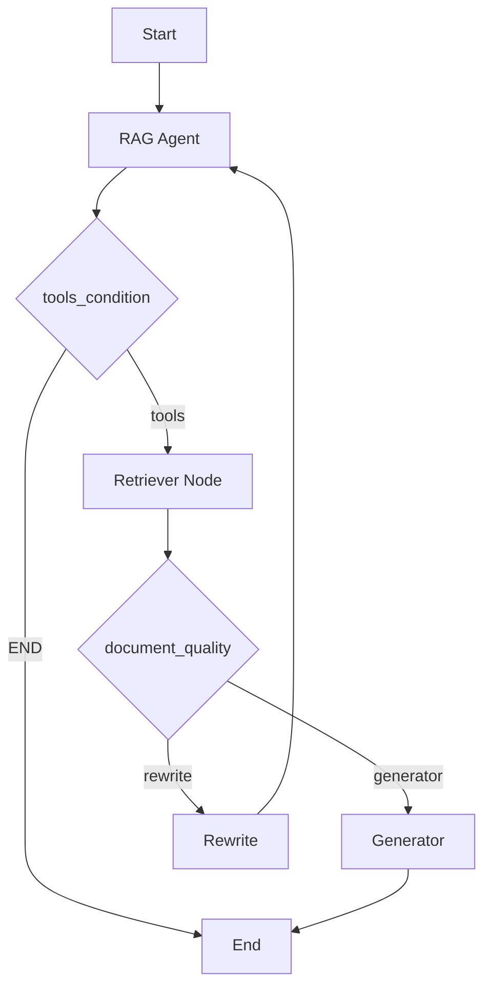
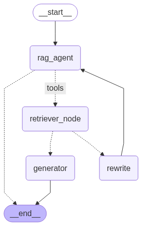

# Agentic RAG Chatbot

[](LICENSE)


An **agentic Retrieval-Augmented Generation (RAG)** chatbot powered by [LangGraph](https://github.com/unikill066/langgraph), OpenAI’s GPT-3.5-turbo, and a Chroma vector store. It allows you to ask questions about **Nikhil Nageshwar Inturi’s** background, publications, projects, and qualifications, and get grounded answers sourced from indexed PDFs and other documents.

The app supports one upload at a time; progress bars updates live. More on the steps that go into the pipeline can be found here: <p align="left">
  <a href="docs/agentic-rag_wiki.md">
    
  </a>
</p>




### Difference b/w [Traditional RAG](https://nikhilrag-ntbaxj9puvp37yaqvkqsiu.streamlit.app/) & Agentic RAG
| Feature                            | Traditional RAG                                                                                   | Agentic RAG                                                                                           |
|------------------------------------|---------------------------------------------------------------------------------------------------|-------------------------------------------------------------------------------------------------------|
| **Overview**                       | Retriever → Generator; static pipeline grounded in retrieved context.                              | RAG + intelligent agent; dynamic decision-making, planning & tool use.                                |
| **Architecture**                   | Fixed sequence: query → embedding → retrieve top-k → prompt → LLM answer.                         | Loop of “Thought → Tool → Observation”; agent decides when/where/how to retrieve or call tools.       |
| **Workflow**                       | One-shot: embed & retrieve → augment prompt → generate answer.                                     | Iterative: plan → retrieve → evaluate → (re-retrieve…) → generate → (optional verify).                |
| **Memory & Reasoning**             | No built-in memory; reasoning is one-pass inside the final LLM call.                              | Maintains state across steps; chain-of-thought exposes planning, self-correction & long-term memory.  |
| **Use Cases**                      | Simple QA on a single knowledge source.                                                           | Complex, multi-step tasks; multi-source routing; tool-augmented actions (e.g. charts, APIs).         |
| **Trade-offs**                     | Simpler, faster, cheaper, easier to debug; limited adaptability.                                  | More flexible & accurate; handles ambiguity; higher latency, cost & engineering complexity.          |
| **LangChain       | Chains: static RetrievalQA/ConversationRetrieval.                                                 | Agents: wrap retrievers as tools (LangChain Agents)      |

> Note: Check out the RAG implementation in this repository: [NikhilRAG](https://github.com/unikill066/NikhilRAG)

## Features

* **Agentic RAG pipeline**
  A state‐graph (`graph.py`) orchestrates:

  1. A router/agent node that decides whether to call a document retriever tool
  2. A document‐quality checker to route between rewriting or generation
  3. A generator node that synthesizes answers from retrieved context
  4. A rewrite node that reformulates queries when no relevant docs are found

      

* **Custom retriever tool**
  Uses [Chroma](https://github.com/langchain-community/langchain-community) to index and retrieve document chunks (via `embed_generator.py` → `./chroma_db`), exposed as a named tool for the agent.

* **Streamlit front-end**
  A chat UI (`streamlit_app.py`) to interact with your RAG agent in real time:

  * Initializes and persists `st.session_state.messages`
  * Shows a welcome prompt and conversation history
  * Invokes the compiled LangGraph state‐graph under the hood
  * Displays “Thinking…” spinners and debug info on demand

* **Embeddings & indexing**
  `embed_generator.py` loads PDFs from `./docs`, splits into chunks, and persists embeddings in `./chroma_db`.

* **Retrieval QA demo**
  A standalone retrieval‐QA script (`bin/retriever.py`) to sanity-check your vector store outside of the state graph.

## Getting Started

### 1. Clone the repo

```bash
git clone https://github.com/unikill066/agentic-rag.git
cd agentic-rag
```

### 2. Install dependencies

Using **pip** (via `requirements.txt`):

```bash
pip install uv
uv venv .venv
source .venv/bin/activate
uv pip install -r requirements.txt
```

Or with **Poetry**, `uv` is just 10-100X faster (via `pyproject.toml`):

```bash
poetry install
poetry shell
```

### 3. Environment variables

Create a `.env`(refer to .env.example) in the repo root and set your OpenAI API key (and, if used, Firebase credentials):

```ini
OPENAI_API_KEY=sk-...
LANGSMITH_TRACING=true
LANGSMITH_ENDPOINT="https://api.smith.langchain.com"
LANGSMITH_API_KEY=ls-...
LANGSMITH_PROJECT="proj_name"
```

### 4. Index your documents

Put any `.pdf` files you want to query into `./docs/` then run:

```bash
python bin/embed_generator.py
```

This will split and embed your PDFs into `./chroma_db`.

### 5. Run the Streamlit app

```bash
streamlit run streamlit_app-local.py
```

Open your browser at `http://localhost:8501` and start asking questions!

## Repo Structure

```
.
├── bin/
│   ├── embed_generator.py     # PDF -> Chroma embedding pipeline
│   └── retriever.py           # Standalone RetrievalQA demo for testing
├── chroma_db
├── constants.py
├── graph.py                   # builds & compiles the LangGraph Agentic RAG agent
├── streamlit_app.py           # Streamlit front‐end & chat UI
├── requirements.txt
├── pyproject.toml
└── README.md
```

## License

This project is licensed under the [MIT License](LICENSE).

> Built by [Nikhil Nageshwar Inturi](https://github.com/unikill066) • 2025-06-22
>
> Contact: [ Gmail ](mailto:inturinikhilnageshwar@gmail.com)
