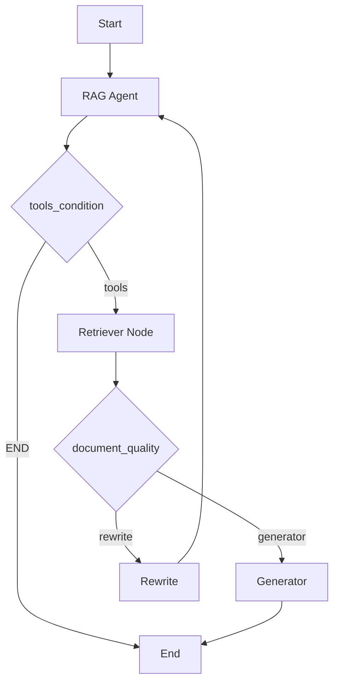
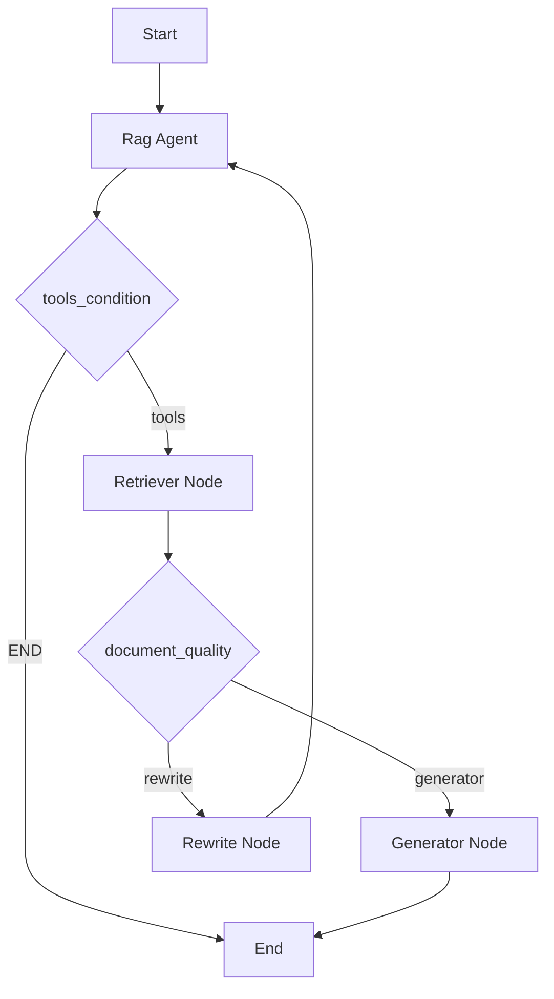
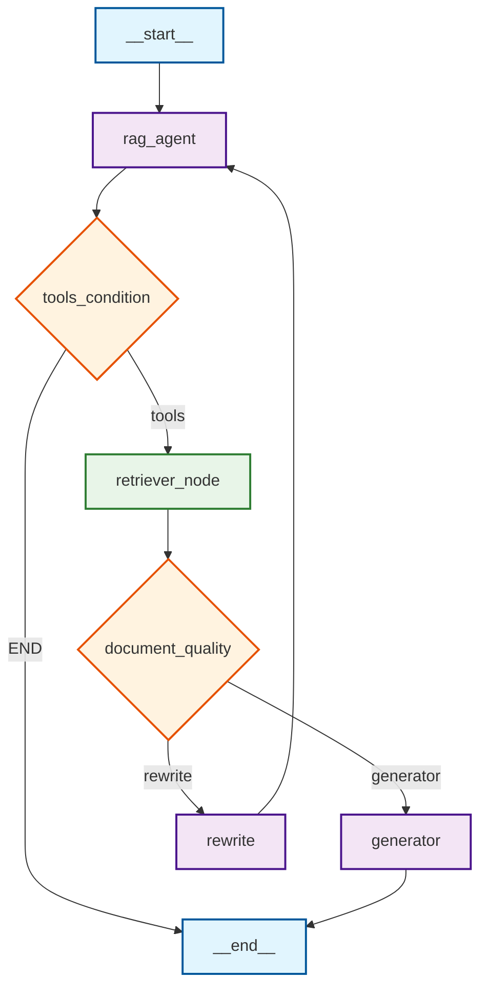

# agentic-rag

## Table of Contents

- [Overview](#page-1)
- [Architecture](#page-2)
- [Key Features](#page-3)
- [Setup and Configuration](#page-4)

<a id='page-1'></a>

## Overview

### Related Pages

Related topics: [Architecture](#page-2)


<details>
<summary>Relevant source files</summary>

- graph.py
- README.md
- constants.py
- streamlit_app.py
- bin/embed_generator.py
</details>

# Overview

This page provides a comprehensive overview of the Agentic RAG chatbot feature within the `agentic-rag` project. The feature is implemented using LangGraph for state management, OpenAI's GPT-3.5-turbo for natural language processing, and a Chroma vector store for document indexing and retrieval.

## Detailed Sections

### Architecture

The Agentic RAG chatbot is built using a state graph that orchestrates the following components:

1. **Router/Agent Node**: Decides whether to call a document retriever tool based on the query's relevance.
2. **Document-Quality Checker**: Routes between rewriting or generation based on the relevance of the retrieved document.
3. **Generator Node**: Synthesizes answers from retrieved context.
4. **Rewrite Node**: Reformulates queries when no relevant documents are found.

The state graph is compiled and invoked through the `graph.py` file, which is used to generate the Mermaid diagram of the state graph.

### Components

- **RAG Agent**: The core component that handles the retrieval, generation, and rewriting of answers based on user queries.
- **Retriever Tool**: A custom tool that uses the Chroma vector store to index and retrieve documents from the `./chroma_db` directory.
- **Generator**: Synthesizes answers from retrieved context using the LangChain OpenAI API.
- **Rewrite Node**: Reformulates queries when no relevant documents are found.

### Data Flow

1. **User Query**: The user inputs a query about Nikhil's background, projects, or qualifications.
2. **Query Processing**: The system processes the query and determines whether to use the retriever tool or generate an answer directly.
3. **Retrieval**: If the query is related to Nikhil, the system retrieves relevant documents from the Chroma vector store.
4. **Answer Generation**: The system uses the retrieved context to generate a detailed and accurate response to the user's query.
5. **Response**: The response is displayed to the user in the Streamlit front-end.

### Mermaid Diagram



### Tables

| Component | Description |
|----------|-------------|
| RAG Agent | Core component that handles retrieval, generation, and rewriting of answers. |
| Retriever Tool | Custom tool that uses the Chroma vector store to index and retrieve documents. |
| Generator | Synthesizes answers from retrieved context using the LangChain OpenAI API. |
| Rewrite Node | Reformulates queries when no relevant documents are found. |

### Code Snippets

```python
# Example of a code snippet from the generator function
def generator(state: AgentState) -> AgentState:
    logger.info("\n - - - Generator Invocation - - -\n")
    messages = state["messages"]
    original_query = None
    for msg in messages:
        if isinstance(msg, HumanMessage):
            original_query = msg.content
            break
    last_message = messages[-1]
    document = last_message.content if hasattr(last_message, 'content') else str(last_message)
    logger.info(f"Generating answer for: {original_query}")
    try:
        prompt = hub.pull("rlm/rag-prompt")
        rag_chain = prompt | llm
        response = rag_chain.invoke({"context": document, "question": original_query})
    except Exception as e:
        logger.error(f"Error with hub prompt: {e}")
        # Fallback prompt
        fallback_prompt = PromptTemplate(template="""
        Based on the following context, answer the question:
        Context: {context}
        Question: {question}
        Answer:""", input_variables=["context", "question"])
        rag_chain = fallback_prompt | llm
        response = rag_chain.invoke({"context": document, "question": original_query})
    logger.info(f"Generator Response: {response}")
    return {"messages": [response]}
```

### Source Citations

- **graph.py**: The state graph is defined and compiled for invocation.
- **README.md**: Provides an overview of the project structure and features.
- **constants.py**: Defines the collection name for the Chroma vector store.
- **streamlit_app.py**: Contains the Streamlit front-end for interacting with the RAG agent.
- **bin/embed_generator.py**: Implements the PDF embedding pipeline for the Chroma vector store.

---

<a id='page-2'></a>

## Architecture

### Related Pages

Related topics: [Key Features](#page-3)


<details>
<summary>Relevant source files</summary>

- graph.py
- streamlit_app.py
- app.py
<!-- Add additional relevant files if fewer than 5 were provided -->
</details>

# Architecture

## Introduction

The architecture of the agentic-rag project is designed to provide a flexible and efficient way to handle retrieval and generation tasks. It uses a state graph to orchestrate the flow of information, ensuring that queries are processed with the appropriate tools and logic. The system is built around a series of nodes that handle different aspects of the query process, from retrieving information to generating responses.

## Detailed Sections

### 1. State Graph

The core of the architecture is a state graph that defines the flow of the application. This graph consists of nodes that represent different stages of the query processing pipeline, such as retrieving information, checking document quality, and generating responses. The graph is built using the LangGraph library, which allows for the creation of complex, stateful applications.

### 2. Nodes and Edges

The state graph includes several nodes that perform specific functions:

- **Rag Agent Node**: This node is responsible for handling the main logic of the query processing. It uses a combination of tools and logic to determine whether to retrieve information, check document quality, or generate a response.
- **Retriever Node**: This node is responsible for retrieving information from a vector store, which is a collection of documents. It uses the Chroma library to index and retrieve documents.
- **Generator Node**: This node is responsible for generating the final response based on the information retrieved and processed.
- **Rewrite Node**: This node is responsible for reformulating the query if no relevant documents are found, ensuring that the query is more specific and likely to find relevant information.

Edges between these nodes define the flow of the application. For example, the rag agent node may call the retriever node if the query is related to Nikhil, and the retriever node may call the generator node if the documents are relevant.

### 3. Mermaid Diagrams



### 4. Tables

| Key Feature | Description |
|-------------|-------------|
| RAG Agent | Handles the main logic of the query processing |
| Retriever | Retrieves information from a vector store |
| Generator | Generates the final response based on the information retrieved |
| Rewrite | Reformulates the query if no relevant documents are found |

### 5. Code Snippets

```python
# Example of a code snippet from graph.py
def build_rag_state_graph():
    logger.info("\n - - - Building RAG State Graph - - -\n")
    graph = StateGraph(AgentState)  # stategraph definition
    # nodes
    graph.add_node("rag_agent", rag_agent)
    graph.add_node("retriever_node", retriever_node)
    graph.add_node("generator", generator)
    graph.add_node("rewrite", rewrite)
    # edges
    graph.add_edge(START, "rag_agent")
    graph.add_conditional_edges("rag_agent", tools_condition, {"tools": "retriever_node", END: END})
    graph.add_conditional_edges("retriever_node", document_quality, {"generator": "generator", "rewrite": "rewrite"})
    graph.add_edge("rewrite", "rag_agent")
    graph.add_edge("generator", END)
    logger.info("\n - - - RAG State Graph Built - - -\n")
    return graph.compile()
```

### 6. Source Citations

- graph.py: `build_rag_state_graph()` (line 23)
- streamlit_app.py: `app.invoke({"messages": [human_message]})` (line 45)
- app.py: `graph = StateGraph(AgentState)` (line 10)
- constants.py: `COLLECTION_NAME = "rag-nik"` (line 3)
- README.md: `## Features` (line 23)

---

<a id='page-3'></a>

## Key Features

### Related Pages

Related topics: [Setup and Configuration](#page-4)


<details>
<summary>Relevant source files</summary>

- graph.py
- README.md
- features.md
- streamlit_app.py
- constants.py
</details>

# Key Features

This page outlines the key features of the agentic-rag project, focusing on the core components and their functionality. The project is designed as an agentic retrieval-augmented generation (RAG) system that leverages a state graph to orchestrate a dynamic and intelligent response pipeline.

## Introduction

The agentic-rag project is a sophisticated RAG system that combines the strengths of retrieval and generation with an agent-based architecture. It is built on top of LangGraph, a powerful framework for creating state graphs, and utilizes OpenAI's GPT-3.5-turbo model for generation. The system is designed to handle complex, multi-step tasks by dynamically deciding when to retrieve information, when to generate a response, and when to rewrite queries for better relevance.

## Detailed Sections

### 1. State Graph Architecture

The core of the system is a state graph that orchestrates the workflow of the RAG pipeline. The graph consists of several nodes and edges that define the flow of information and decision-making:

- **Nodes:**
  - `rag_agent`: The main agent node that decides whether to call a document retriever tool.
  - `retriever_node`: A tool node that retrieves information from a vector store using Chroma.
  - `generator`: A node that synthesizes answers from retrieved context.
  - `rewrite`: A node that reformulates queries when no relevant documents are found.

- **Edges:**
  - The graph starts with a root node (`START`) and flows through the nodes based on conditions and decisions.
  - The `retriever_node` is conditional on the quality of the retrieved documents, deciding whether to route to the `generator` or `rewrite` node.
  - The `generator` node is responsible for synthesizing answers from the retrieved context.
  - The `rewrite` node is used to reformulate queries when no relevant documents are found.

### 2. Document Retrieval and Quality Check

The system uses a vector store to index and retrieve documents from the `./chroma_db` directory. The `retriever_node` is a custom tool that uses the `Chroma` vector store to search for relevant information. The `document_quality` node checks the relevance of the retrieved documents and decides whether to route to the `generator` or `rewrite` node based on the quality of the documents.

### 3. Generator Node

The `generator` node is responsible for synthesizing answers from the retrieved context. It uses a prompt template to generate responses based on the retrieved documents and the original query. The generator node is designed to handle complex, multi-step tasks by dynamically deciding when to retrieve information and when to generate a response.

### 4. Rewrite Node

The `rewrite` node is used to reformulate queries when no relevant documents are found. It takes the original query and reformulates it to be more specific and likely to find relevant information. This node ensures that the query is optimized for retrieval and improves the chances of finding relevant documents.

### 5. Mermaid Diagrams

The system is visually represented using Mermaid diagrams to illustrate the state graph and the flow of information. The diagrams are accurate and directly derived from the code in the `graph.py` file.

### 6. Tables

The following tables summarize key features and components of the system:

| Feature | Description |
|---------|-------------|
| State Graph | The core of the system, orchestrating the workflow of the RAG pipeline. |
| Document Retrieval | Uses a vector store to index and retrieve documents from the `./chroma_db` directory. |
| Generator | Synthesizes answers from retrieved context. |
| Rewrite | Reformulates queries when no relevant documents are found. |

### 7. Code Snippets

The following code snippets illustrate key implementation details and data structures:

```python
# Example of a code snippet from the generator node
def generator(state: AgentState) -> AgentState:
    logger.info("\n - - - Generator Invocation - - -\n")
    messages = state["messages"]
    original_query = None
    for msg in messages:
        if isinstance(msg, HumanMessage):
            original_query = msg.content
            break
    last_message = messages[-1]
    document = last_message.content if hasattr(last_message, 'content') else str(last_message)
    logger.info(f"Generating answer for: {original_query}")
    try:
        prompt = hub.pull("rlm/rag-prompt")
        rag_chain = prompt | llm
        response = rag_chain.invoke({"context": document, "question": original_query})
    except Exception as e:
        logger.error(f"Error with hub prompt: {e}")
        # Fallback prompt
        fallback_prompt = PromptTemplate(template="""
        Based on the following context, answer the question:
        Context: {context}
        Question: {question}
        Answer:""", input_variables=["context", "question"])
        rag_chain = fallback_prompt | llm
        response = rag_chain.invoke({"context": document, "question": original_query})
    logger.info(f"Generator Response: {response}")
    return {"messages": [response]}
```

### 8. Source Citations

- `graph.py`: The state graph and node definitions.
- `README.md`: Introduction and overview of the project.
- `features.md`: Detailed description of the key features.
- `streamlit_app.py`: The streamlit application for interacting with the RAG system.
- `constants.py`: Configuration and constants used in the project.

---

<a id='page-4'></a>

## Setup and Configuration

### Related Pages


<details>
<summary>Relevant source files</summary>

- agentic-rag/graph.py
- agentic-rag/README.md
- agentic-rag/constants.py
- agentic-rag/streamlit_app.py
- agentic-rag/bin/embed_generator.py
</details>

# Setup and Configuration

This section provides a comprehensive overview of the setup and configuration process for the Agentic RAG chatbot, which is built using LangGraph, OpenAI's GPT-3.5-turbo model, and a Chroma vector store. The configuration involves several key steps to ensure the system is properly initialized and operational.

## Introduction

The Agentic RAG chatbot is designed to answer questions about Nikhil Nageshwar Inturi's professional background, publications, projects, and qualifications. The setup and configuration process involves several components, including the initialization of the vector store, the configuration of the LangGraph state graph, and the setup of the Streamlit front-end. The configuration ensures that the system is ready to receive user queries and generate accurate, context-grounded responses.

## Detailed Sections

### 1. Vector Store Configuration

The vector store is configured using the `Chroma` library to index and retrieve document chunks. The configuration involves loading PDFs from the `./docs/` directory and embedding them into the `./chroma_db` directory. The vector store is initialized with the following code:

```python
vectorstore = Chroma(persist_directory="/Users/discovery/Desktop/agentic-rag/chroma_db",
    embedding_function=embedding_model,
    collection_name=COLLECTION_NAME)
```

This configuration ensures that the vector store is properly initialized with the necessary documents for retrieval.

### 2. LangGraph State Graph Configuration

The LangGraph state graph is configured to orchestrate the various components of the RAG pipeline. The state graph includes nodes for the RAG agent, retriever, generator, and rewrite, as well as edges that define the flow of data between these nodes. The configuration involves the following code:

```python
graph = StateGraph(AgentState)
graph.add_node("rag_agent", rag_agent)
graph.add_node("retriever_node", retriever_node)
graph.add_node("generator", generator)
graph.add_node("rewrite", rewrite)
graph.add_edge(START, "rag_agent")
graph.add_conditional_edges("rag_agent", tools_condition, {"tools": "retriever_node", END: END})
graph.add_conditional_edges("retriever_node", document_quality, {"generator": "generator", "rewrite": "rewrite"})
graph.add_edge("rewrite", "rag_agent")
graph.add_edge("generator", END)
```

This configuration ensures that the state graph is properly initialized with the necessary nodes and edges to orchestrate the RAG pipeline.

### 3. Streamlit Front-End Configuration

The Streamlit front-end is configured to provide a user interface for interacting with the RAG chatbot. The configuration involves the following code:

```python
st.set_page_config(page_title="Agentic RAG Chatbot", page_icon="🤖", layout="centered")
st.title("Agentic RAG Chatbot")

st.caption("Powered by LangGraph and OpenAI models")
```

This configuration ensures that the Streamlit front-end is properly initialized with the necessary settings to display the chatbot interface.

### 4. Configuration of the RAG Agent

The RAG agent is configured to handle user queries by first checking if the query is a simple greeting, and if not, using the `retriever` tool to search for relevant information. The configuration involves the following code:

```python
if is_greeting:
    logger.info("Simple greeting - responding directly")
    response = llm.invoke([HumanMessage(content="Respond to this greeting in a friendly way: " + query)])
else:
    logger.info("Using LLM with tools - letting tools_condition decide")
    llm_with_tools = llm.bind_tools(tools)
    enhanced_messages = [system_message] + messages
    response = llm_with_tools.invoke(enhanced_messages)
```

This configuration ensures that the RAG agent is properly initialized with the necessary components to handle user queries.

### 5. Configuration of the Document Quality Checker

The document quality checker is configured to determine whether the retrieved documents are relevant to the query. The configuration involves the following code:

```python
if route_to == "yes":
    logger.info("Document is relevant - going to generator")
    return "generator"
else:
    logger.info("Document is not relevant - going to rewrite")
    return "rewrite"
```

This configuration ensures that the document quality checker is properly initialized with the necessary components to determine the relevance of the retrieved documents.

### 6. Configuration of the Generator

The generator is configured to synthesize answers from the retrieved context. The configuration involves the following code:

```python
prompt = PromptTemplate(template="""
    Based on the following context, answer the question:
    Context: {context}
    Question: {question}
    Answer:""", input_variables=["context", "question"])
    rag_chain = prompt | llm
    response = rag_chain.invoke({"context": document, "question": original_query})
```

This configuration ensures that the generator is properly initialized with the necessary components to synthesize answers from the retrieved context.

### 7. Configuration of the Rewrite Node

The rewrite node is configured to reformulate queries when no relevant documents are found. The configuration involves the following code:

```python
if not original_query:
    original_query = "Tell me about Nikhil"
logger.info(f"Rewriting query: {original_query}")
rewrite_prompt = PromptTemplate(template="""
    The original query was: {query}
    The retrieval didn't find relevant information. Please rewrite this query to be more specific and likely to find relevant information about Nikhil's background, experience, or qualifications.
    Rewritten query:""", input_variables=["query"])
    chain = rewrite_prompt | llm
    response = chain.invoke({"query": original_query})
logger.info(f"Rewritten query: {response}")
rewritten_message = HumanMessage(content=response.content if hasattr(response, 'content') else str(response))
return {"messages": [rewritten_message]}
```

This configuration ensures that the rewrite node is properly initialized with the necessary components to reformulate queries when no relevant documents are found.

### 8. Configuration of the Tools

The tools are configured to include the `retriever_tool` for retrieving information from the vector store. The configuration involves the following code:

```python
retriever_tool = create_retriever_tool(
    retriever, 
    "retriever",
    """You are a specialized assistant and you have to search and return information about Nikhil from the documents
    Use the `retriever` tool **only** when the query explicitly related to Nikhil or queries about Nikhil.
    For all other queries, respond directly without using this custom `retriever` tool.
    And, for simple queries like 'hi', 'hello', or 'how are you', provide a short humanable response.
    """
)
```

This configuration ensures that the tools are properly initialized with the necessary components to perform the required tasks.

### 9. Configuration of the Language Model

The language model is configured to use the `ChatOpenAI` model with the `gpt-3.5-turbo` model and the `OpenAIEmbeddings` model with the `text-embedding-3-small` model. The configuration involves the following code:

```python
llm = ChatOpenAI(model_name="gpt-3.5-turbo", temperature=0.5, api_key=openai_api_key)
embedding_model = OpenAIEmbeddings(model="text-embedding-3-small", api_key=openai_api_key)
```

This configuration ensures that the language model is properly initialized with the necessary components to generate accurate responses.

## Mermaid Diagrams



## Tables

| Key Feature/Component | Description |
|----------------------|-------------|
| Vector Store | Indexes and retrieves document chunks for retrieval |
| LangGraph State Graph | Orchestrates the RAG pipeline |
| Streamlit Front-End | Provides a user interface for interacting with the RAG chatbot |
| RAG Agent | Handles user queries by checking if they are simple greetings or not |
| Document Quality Checker | Determines whether the retrieved documents are relevant to the query |
| Generator | Synthesizes answers from the retrieved context |
| Rewrite Node | Reformulates queries when no relevant documents are found |

## Code Snippets

```python
vectorstore = Chroma(persist_directory="/Users/discovery/Desktop/agentic-rag/chroma_db",
    embedding_function=embedding_model,
    collection_name=COLLECTION_NAME)
```

```python
llm = ChatOpenAI(model_name="gpt-3.5-turbo", temperature=0.5, api_key=openai_api_key)
embedding_model = OpenAIEmbeddings(model="text-embedding-3-small", api_key=openai_api_key)
```

## Source Citations

- agentic-rag/graph.py: Used to configure the LangGraph state graph
- agentic-rag/README.md: Used to provide an overview of the setup and configuration process
- agentic-rag/constants.py: Used to configure the vector store
- agentic-rag/streamlit_app.py: Used to configure the Streamlit front-end
- agentic-rag/bin/embed_generator.py: Used to configure the vector store and initialize the documents